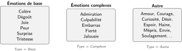
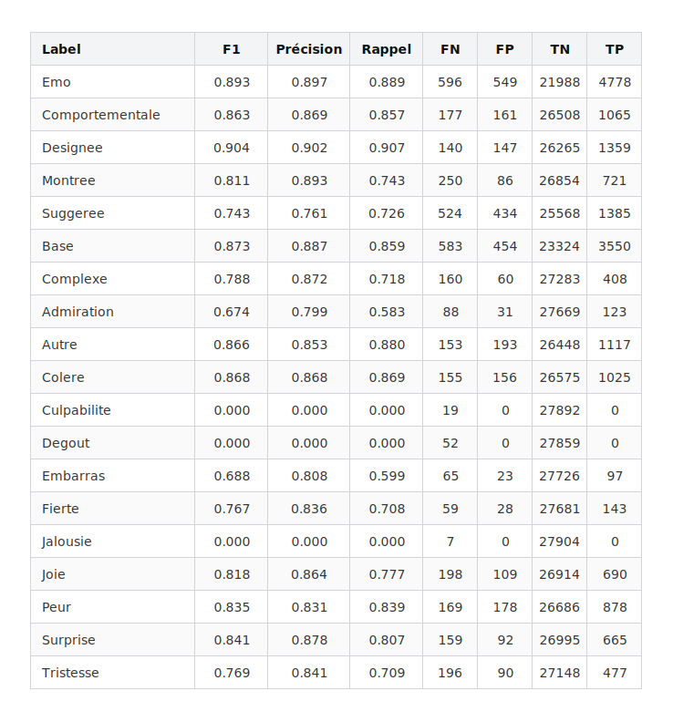
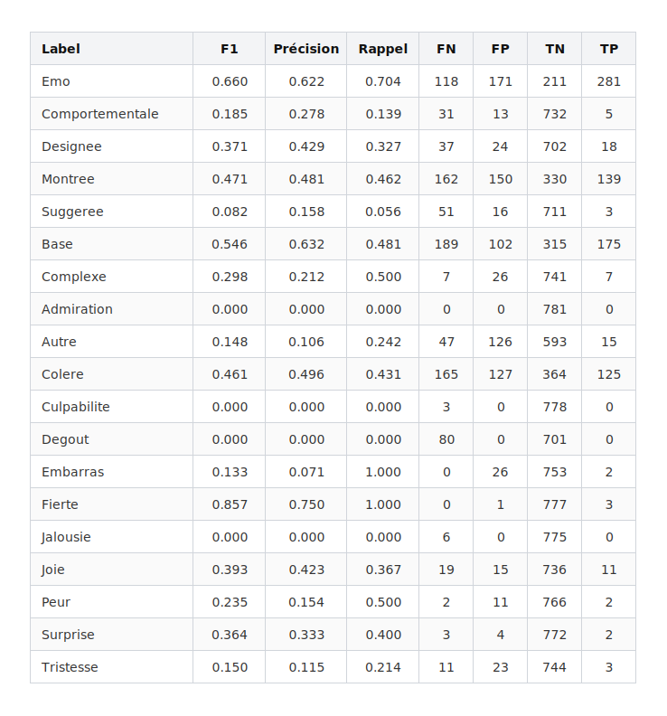
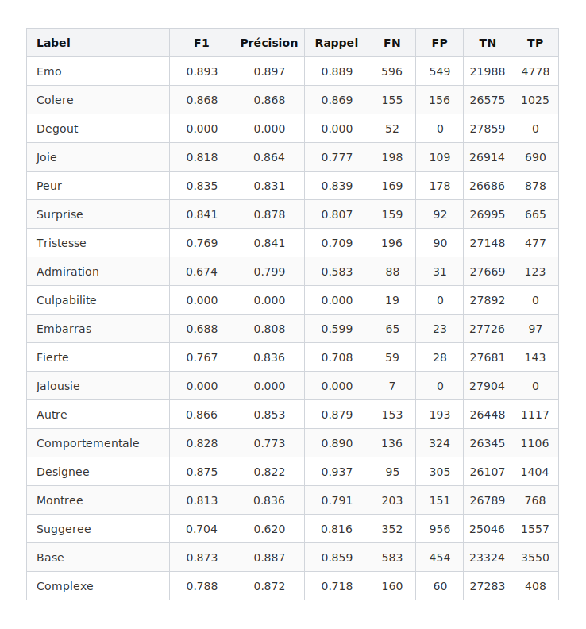
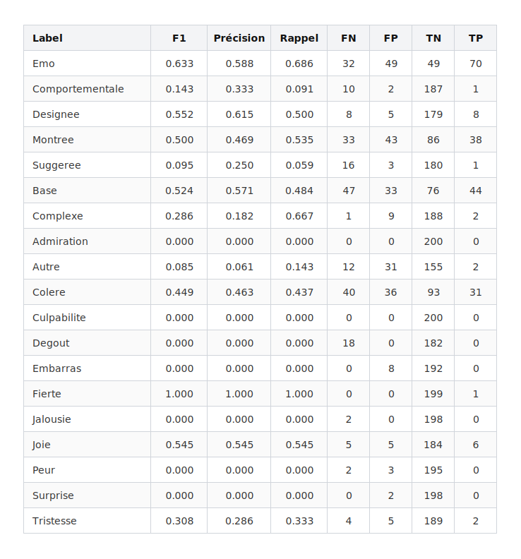
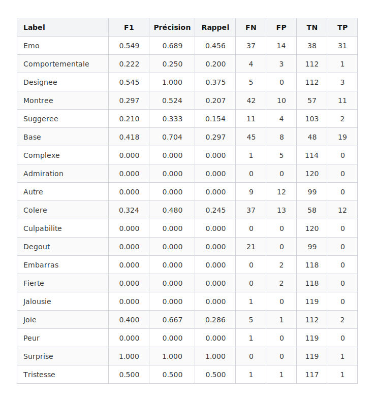
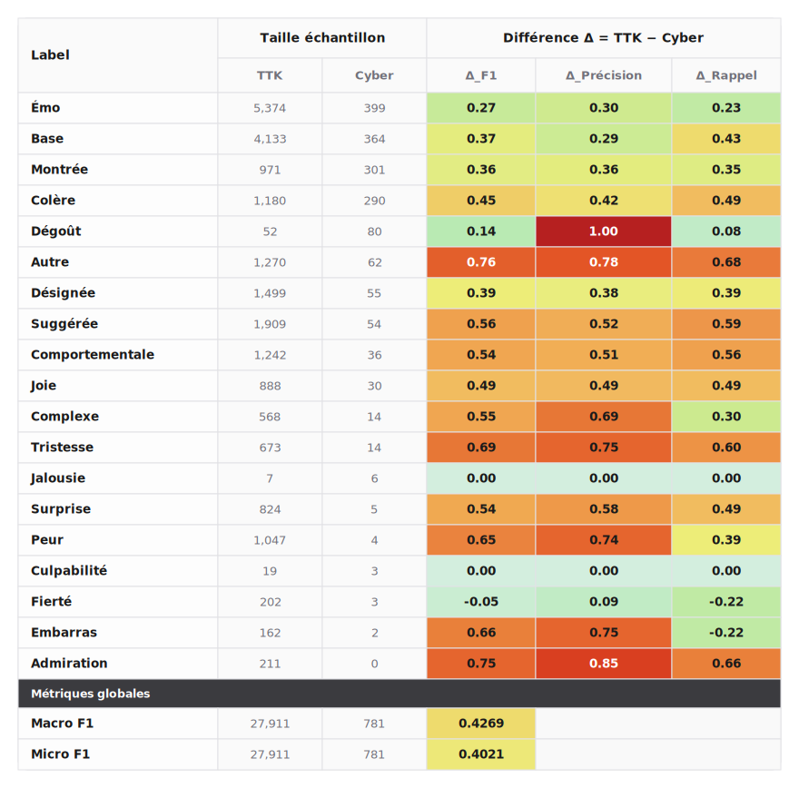
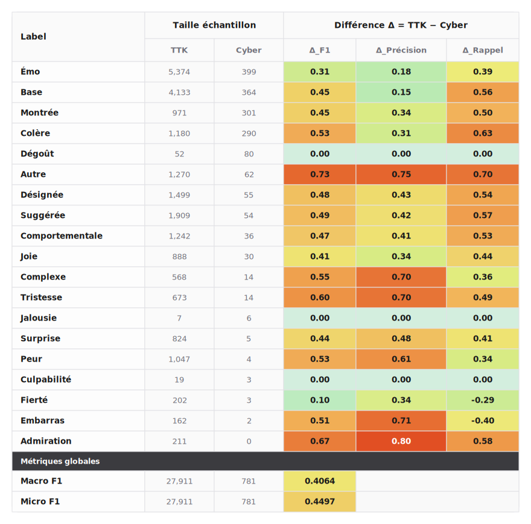

# Évaluation du modèle EMOTYC

Ce dépôt a été conçu pour évaluer les performances du modèle **[EMOTYC](https://huggingface.co/TextToKids/CamemBERT-base-EmoTextToKids)** sur le corpus [CyberAgression-Large](https://github.com/aollagnier/CyberAgression-Large), contenant des messages de cyberharcèlement en français rédigés par des jeunes âgés de 11 à 18 ans. EMOTYC a été conçu par Etienne ([2023](https://bdr.parisnanterre.fr/theses/internet/2023/2023PA100047/2023PA100047.pdf)) dans le cadre du projet [ANR TextToKids](https://texttokids.irisa.fr/publications/)

## 1. Cadre théorique et schéma d'annotation utilisé

Le modèle EMOTYC est basé sur CamemBERT et effectue une classification multi-label. Sa tête de classification output une valeur binaire pour 19 labels organisés en 4 groupes sémantiques : le **Caractère Émotionnel**, les **catégories émotionelles**, les **modes d'expression** et le **type** :

<br>
<p align="center">
  
</p>

Formellement, la prédiction est de la forme : [ŷ₁, ..., ŷ₁₉] ∈ {0, 1}¹⁹.

Les trois labels `Emo`, `Base` et `Complexe` sont déduits des autres labels. Cela s'appuie sur un cadre théorique qui distingue émotions de base et émotions complexes :

<br>
<p align="center">
  
</p>

Ainsi, si une instance est étiquetée `Base = 1` dans le gold, cela peut être interprété comme une disjonction entre toutes les émotions appartenant à l'ensemble des « émotions de base » (cette disjonction étant inclusive, car plusieurs émotions peuvent être activées à la fois sur une même unité textuelle). Cette logique de disjonction est la même pour `Complexe = 1` (avec l'ensemble des émotions complexes) et pour `Emo = 1` (avec tous les labels émotionnels).

Il est possible de mesurer la « cohérence » des prédictions du modèle EMOTYC avec ce cadre théorique (p. ex., il ne devrait pas prédire `Base = 1` si aucune émotion de base n'est activée, ni prédire une émotion complexe — par exemple `Culpabilité = 1` — sans prédire `Complexe = 1`). Cette cohérence n'est pas mesurée ici, mais elle l'est [dans ce script](https://github.com/GwenTsang/EMOTYC/blob/master/scripts/emotyc_sanity_check.py).

Le schéma d'annotation originel s'opère au niveau des segments textuels et est au format Glozz, voir Etienne et Battistelli ([2021](https://hal.science/hal-03263194v1/document)).

Ici, les corpus testés sont :

- [TextToKids](`golds/emotexttokids_gold_flat.xlsx`) noté TTK ci-après.
- [CyberAggAdo](`golds/CyberAdoAgg_gold_global_total.xlsx`)

Et deux versions échantillonnées aléatoirement de CyberAggAdo, la première est [RandomSample120](`golds/random_sample_120.xlsx`)


Le dossier [`results`](results) contient l'ensemble des inférences déjà générées par les scripts d'inférence sont organisées par corpus évalué et par configuration testée.

## 2. Performances du modèle EMOTYC

### Métriques utilisées

La précision mesure la fiabilité des prédictions positives :

$$
\text{Precision} = \frac{TP}{TP + FP}
$$

Elle évalue, parmi les instances prédites comme positives par le modèle, la proportion réellement correcte. Une baisse de précision sur CyberAggAdo indique une augmentation des faux positifs : EMOTYC attribue à tort un label émotionnel. Cela suggère que certains indices lexicaux ou contextuels valides dans TTK deviennent trompeurs dans CyberAggAdo.

Le rappel mesure la capacité du modèle à retrouver les instances réellement positives :

$$
\text{Recall} = \frac{TP}{TP + FN}
$$

Il porte sur l’ensemble des instances pour lesquelles `y=1`. Une baisse de rappel indique une augmentation des faux négatifs : EMOTYC ne détecte plus certaines occurrences. Cela suggère par ex. que l’émotion concernée est exprimée dans CyberAggAdo par des formes lexicales, discursives ou contextuelles différentes de celles apprises sur TTK (EMOTYC n'ayant jamais vu ces formes, il ne les détecte pas).

### 2.1.1. Répliquer les résultats officiels sur le corpus Test

Etienne et al. ([2024](https://arxiv.org/abs/2405.14385)) rapportent les performances suivantes, sur le sous ensemble TEST du corpus TTK, avec les phrases adjacentes (contexte) injectées dans le template BCA et des seuils à 0.5 pour tous les labels :

|  | Rappel (Macro) | Précision (Macro) | Macro F1 |
| :--- | :---: | :---: | :---: |
| Présence d'une émotion | 0.76 | 0.74 | 0.75 |
| Mode d'expression | 0.63 | 0.67 | 0.64 |
| Type | 0.56 | 0.66 | 0.60 |
| Catégorie émotionnelle | 0.40 | 0.46 | 0.42 |

Nous avons essayé de reproduire à l'identique ces paramètres, en partant du sous-ensemble TEST du [corpus TTK donné sur HuggingFace](https://huggingface.co/datasets/TextToKids/EmoTextToKids-sentences/blob/main/data/test-00000-of-00001.parquet) ainsi qu'avec les poids du modèle donnés sur [HuggingFace](https://huggingface.co/TextToKids/CamemBERT-base-EmoTextToKids) à travers le script [`emotyc_predict_parquet.py`](emotyc_predict_parquet.py), qui a été exécuté dans ce [notebook Colab T4](https://colab.research.google.com/drive/17dVMtpKE4Ca2eKJ_tDvaUa1FF-e6igjn?usp=sharing). Mais les performances obtenues sont supérieures à celles qui sont documentées dans l'article :

|  | Rappel (Macro) | Précision (Macro) | Macro F1 |
| :--- | :---: | :---: | :---: |
| Présence d'une émotion | 0.93 | 0.92 | 0.92 |
| Mode d'expression | 0.81 | 0.82 | 0.81 |
| Type | 0.76 | 0.83 | 0.79 |
| Catégorie émotionnelle | 0.55 | 0.60 | 0.57 |

Une hypothèse pour expliquer ces écarts serait que les résultats donnés dans l'article découlent d'une moyenne des performances des différents "checkpoints" du modèle EMOTYC (une moyenne de ses performances à travers les epochs), et qu'on accède, via le dépôt HuggingFace, aux meilleurs checkpoints (aux meilleurs poids).

Performances détaillées label par label :




### 2.1.2. Performance sur CyberAggAdo avec les mêmes paramètres

Le script [`orchestration_cyberaggado.py`](orchestration_cyberaggado.py) permet de faire une comparaison honnête en utilisant exactement la même configuration que celle ayant donné les résultats exposé dans la section 2.1. ci-dessus. On obtient donc :

|  | Rappel (Macro) | Précision (Macro) | Macro F1 |
| :--- | :---: | :---: | :---: |
| Présence d'une émotion | 0.63 | 0.63 | 0.63 |
| Mode d'expression | 0.25 | 0.34 | 0.28 |
| Type | 0.49 | 0.42 | 0.42 |
| Catégorie émotionnelle | 0.35 | 0.20 | 0.23 |

Performances détaillées par label :



### 2.2. Comparaison des performances en modifiant un seuil

Les résultats sont un petit peu plus favorable pour CyberAggAdo si on utilise un seuil à 0.06 pour les modes, et cela ne dégrade pas la performance sur TTK.

#### 2.2.1. Performance d'EMOTYC avec le contexte (phrases adjacentes) + seuil à 0.06 pour les 4 modes sur CyberAggAdo

Les résultats obtenus sur CyberAggAdo sont alors :


#### 2.2.2. Performance d'EMOTYC avec le contexte (phrases adjacentes) + seuil à 0.06 pour les 4 modes sur TTK


#### 2.2.3. Performance d'EMOTYC sans contexte (juste phrase cible) + seuil à 0.06 pour les 4 modes sur CyberAggAdo


#### 2.2.4. Performance d'EMOTYC sans contexte (juste phrase cible) + seuil à 0.06 pour les 4 modes sur TTK

Dans CyberAggAdoLarge les erreurs sont un peu plus fortes dans les domaines Religion et Homophobie que dans Obésité et Racisme. Étant donné que Obésité est un corpus plus grand que les autres, cela fait que lorsqu’on agrège tous les corpus avec tirage aléatoire, les performances sont très légèrement moins hautes.



#### 2.2.5. Performance d'EMOTYC sur 4 échantillons de 50 unités textuelles contigues extraites aléatoirement (avec contexte et seuil 05)



#### 2.2.6. Performances d'EMOTYC sur un échantillon de 120 unités (non contigues) extraites aléatoirement



#### 2.3 Performances relatives (écarts) 


##### 2.3.1. Performances TTK _vs_ CyberAggAdo avec les phrases adjacentes :



##### 2.3.2. Performances TTK _vs_ CyberAggAdo sans les phrases adjacentes :




## 

Ci-dessous, deux tableaux issus de [`delta_heatmap.py`](delta_heatmap.py). Les résultats correspondent aux écarts signés par label (Δ = TTK − Cyber). Un Δ positif indique une performance supérieure sur TextToKids ; un Δ négatif indique une performance supérieure sur CyberAggAdo.


$$
\Delta = \text{score}_{TTK} - \text{score}_{CyberAggAdo}
$$

Un Δ positif indique une baisse de performance lors du transfert de TextToKids (TTK) vers CyberAggAdo.


### Tableau des 


## Remarques relatives à la configuration et aux hyperparamètres

Le script [`emotyc_predict.py`](emotyc_predict.py) reprend le template "BCA" (_Before, Current, After_) qui est utilisé lors du fine-tuning du modèle :

```txt
before:{previous_sentence}</s>current: {target_sentence}</s>after:{next_sentence}</s>
```

Lorsque l’option `--use-context` est activée, le script injecte dans le template BCA les phrases immédiatement voisines de la phrase cible : la phrase précédente est placée dans le champ `before`, la phrase courante dans le champ `current`, et la phrase suivante dans le champ `after`. Pour la première et la dernière ligne du fichier, lorsqu’il n’existe pas respectivement de phrase précédente ou suivante, le script remplace le contexte manquant par le token de fin de séquence `</s>`.

L'utilisation de ce template est documentée dans Étienne ([2023](https://theses.hal.science/tel-04210908v1/document), p. 141), dans Étienne et al. (2024, p. 5) (voir l'article sur [ArXiv](https://arxiv.org/pdf/2405.14385) ou sur [ACL](https://aclanthology.org/2024.wassa-1.14.pdf)), ainsi que dans le [README](https://huggingface.co/TextToKids/CamemBERT-base-EmoTextToKids) présent sur le dépôt Hugging Face du modèle. Cela est cohérent avec nos tests, dans lesquels ce template donne les meilleures performances sur le corpus TextToKids.

Par ailleurs, comme dans [l'implémentation officielle d'EMOTYC sur TextToKids](https://gitlab.huma-num.fr/texttokids/ttkwp3-2025/-/blob/main/text_complexity/server/src/processor/semantique/emotyc.py), nous désactivons l'ajout de tokens spéciaux :

```python
add_special_tokens=False
```

Nos tests montrent que les performances d'EMOTYC diminuent quand `add_special_tokens=True`, ce qui suggère que l'ajout de tokens spéciaux était bien désactivé pendant le fine-tuning. Avec `add_special_tokens=False`, le premier token de la séquence n’est pas le token spécial `<s>`, mais le premier token produit par la tokenisation du template BCA, qui correspond au fragment lexical `_be` (car `CamembertTokenizer` ajoute le préfixe `_` lorsqu’un mot est précédé d’un espace). L’état caché associé à ce token en position 0 à la 12e couche du modèle sert de représentation globale utilisée pour la classification.

D'autres tests montrent également que la configuration avec template BCA et `add_special_tokens=True` reste assez performante, bien qu’inférieure à la configuration sans tokens spéciaux. Cela suggère que, dans les deux cas, l'architecture Transformer parvient à diriger l'information pertinente vers la position 0 (qu'il s'agisse du token `_be` lorsque `add_special_tokens=False`, ou du token spécial `<s>` lorsque `add_special_tokens=True`).


### Génération d'un rapport HTML

Convertit le fichier standardisé `emotyc_predictions_summary.json` (généré par les scripts d'inférence) en un rapport HTML lisible, avec possibilité de regrouper les métriques par dimension sémantique.

**Exemple d'utilisation :**
```bash
python json_summary_to_html.py \
    --json ./results/mon_run/emotyc_predictions_summary.json \
    --out ./results/mon_run/rapport.html \
    --groups
```

### Contiguité et non contiguité

Lance l'inférence de manière séquentielle sur plusieurs fichiers Excel, puis fusionne tous les résultats dans un unique dossier `merged`.

L'objectif principal de cet orchestrateur est de préserver l'intégrité du contexte BCA. Si on produit un XLSX qui résulte d'une concaténation, puis qu'on utilise l'option `--use-context`, une phrase située à la fin d'un fichier XLSX se retrouve injectée comme contexte "before" de la première phrase du fichier XLSX suivant. C'est pourquoi il faut lançer le script d'inférence sur chaque bloc ou fichier individuel. L'échantillonnage contigu doit, par défaut, tirer un bloc de taille 50. Si l'indice de départ est `i` (tiré dans l'intervalle `[0 ; len(xlsx) - 50]`), le bloc sélectionné va de `i` jusqu’à `i + 50` exclu.

Si les phrases sont mélangées ou sélectionnées aléatoirement, il faut être très prudent avec `--use-context`. Le contexte `before`/`after` suivrait alors l’ordre du sous-ensemble et non pas les vraies phrases voisines du document source. La recommandation est donc de ne pas utiliser **`--use-context`** pour tout échantillonnage non contigu.

**Exemple d'utilisation :**
```bash
python orchestrate_emotyc_folder.py \
    --input-dir ./golds \
    --out-dir ./results/orchestrated_run \
    --use-context
```


## Remarques relatives à l'optimisation des scripts d'inférence

Nous utilisons `torch.inference_mode()`, ce qui évite de construire le graphe de gradients. Dans le cas contraire, sans `torch.inference_mode()`, PyTorch peut conserver des informations pour calculer les gradients plus tard : activations, relations entre opérations, métadonnées de vues, compteurs de version, etc. Ce paramètre permet en partie d'économiser de la mémoire et du temps côté autograd. L'implémentation officielle est [disponible ici](https://github.com/pytorch/pytorch/blob/main/torch/autograd/grad_mode.py).

Le modèle a été testé sur CPU et sur différents GPU. Sur Colab, avec une Tesla T4, nous conseillons d'utiliser `--batch-size 900`.

## Reproductibilité et commandes utilisées

Pour 2.1.1  :

```bash
python orchestrate_emotyc_folder.py
```

Pour 2.1.2 :

```bash
python orchestration_cyberaggado.py \
    --out_dir ./results/CyberAggAdo/ContextTemplateMode05 \
```

Pour 2.2.1 :

```bash
python emotyc_predict.py \
    --xlsx ./golds/CyberAdoAgg_gold_global_total.xlsx \
    --out_dir ./results/CyberAggAdo/ContextTemplateMode006 \
    --use-context
```
Pour 2.2.2 :

```bash
python emotyc_predict.py \
    --xlsx ./golds/emotexttokids_gold_flat.xlsx \
    --out_dir ./results/TTK/ContextTemplateMode006 \
    --use-context
```

Pour 2.2.3 :

```bash
python emotyc_predict.py \
    --xlsx ./golds/CyberAdoAgg_gold_global_total.xlsx \
    --out_dir ./results/CyberAggAdo/NoContextTemplateMode006
```

Pour 2.2.4 :

```bash
python emotyc_predict.py \
    --xlsx ./golds/emotexttokids_gold_flat.xlsx \
    --out_dir ./results/TTK/NoContextTemplateMode006
```
Puis

```bash
python ./illustrations/json_to_svg.py --json ./results/TTK/NoContextTemplateMode006/emotyc_predictions_summary.json
```

Pour 2.2.5 :

```bash
python3 orchestrate_emotyc_folder.py ./golds/xlsx_samples
```

puis

```bash
python ./illustrations/json_to_svg.py --json ./results/orchestrated_emotyc_xlsx_samples/emotyc_predictions_summary.json
```

Pour 2.3.1 : 

```bash
python delta_heatmap.py \
  --cyber ./results/CyberAggAdo/ContextTemplateAvecEspaceMode006_Rerun/emotyc_predictions_summary.json \
  --ttk ./results/TextToKids/ContextTemplateAvecEspaceMode006/emotyc_predictions_summary.json \
  --out ./results/heatmap_delta_ContextTemplateAvecEspaceMode006.html
```

Pour 2.3.2 : 

```bash
python delta_heatmap.py \
  --cyber ./results/CyberAggAdo/NoContextTemplateAvecEspace_Rerun/emotyc_predictions_summary.json \
  --ttk ./results/TextToKids/NoContextTemplateAvecEspaceMode006/emotyc_predictions_summary.json \
  --out ./results/heatmap_delta_NoContextTemplateAvecEspaceMode006.html
```
